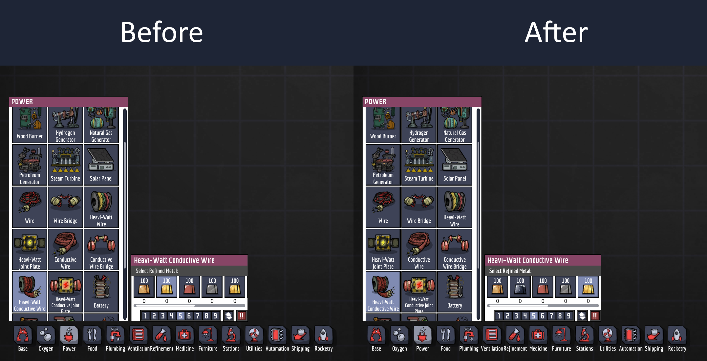

# LeadColorFixMod
Mod for Oxygen Not Included to fix the textures and colors of lead

	

All of lead's textures and colors are updated to be distinct from gold's, using Klei's own assets where available.

	

The material overlay screen is also updated.

	

So now you can find and replace lead structures without missing any!

	

